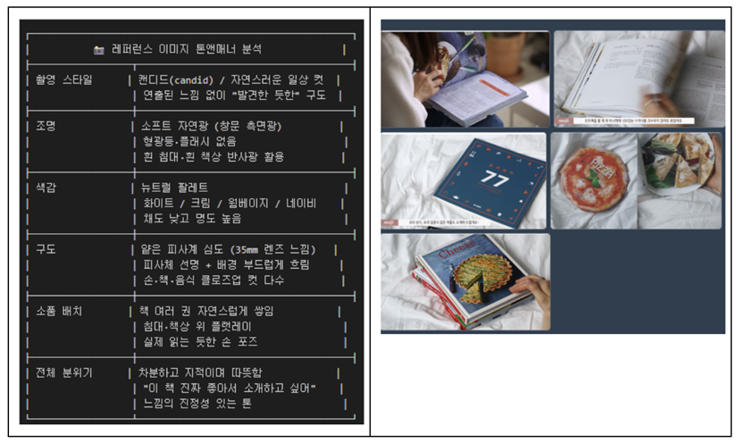

# **B1-2 스토리보드(기획) 문서_‘할머니 손맛 전라도’ 레시피북 소개 영상**

> 본 보고서 할머니 손맛 전라도 레시피북 브랜드 광고 영상 제작 프로젝트를 위한 스토리보드(기획) 문서입니다. 총 10초 분량의 영상을 2개 씬으로 구성했습니다.
> 
> - 씬 1은 텅 빈 냉장고로 시청자 공감을 유발하고,
> - 씬 2는 레시피북 표지를 등장시켜 제품을 각인시킵니다.
> - 씬 3은 레시피 내지 클로즈업으로 신뢰감을 확보하고,
> - 씬 4는 브랜드 슬로건과 CTA로 마무리합니다.

각 씬마다 전라도 사투리를 활용한 할머니 유머 포인트를 삽입해 친근함을 극대화했습니다. 제작 도구는 Gemie, Flow, Vrew, Suno AI를 조합해 사용하며, Runway 크레딧은 씬 1·3에만 집중해 최소화합니다. 화풍 일관성은 씬 1 기준 이미지를 --sref로 고정해 유지합니다. 감정 아크는 공감→웃음→신뢰→구매욕구 4단계로 설계되었습니다.

대응 도구 : 비디오 생성/변환도구(Gemin, Flow), 오디오 대안(Suno), 음성 합성 대안(Vrew)

### 레시피북_등장_및_소개_영상

URL : https://github.com/80gina/B1-02/blob/main/%5BB1-2%5D%20%EC%B5%9C%EC%A2%85%20%EC%98%81%EC%83%81.mp4

---

- 길이: 10초 이내
- 인코딩 스펙 : 해상도: 1080p / 프레임레이트: 24~30fps/ 코덱: H.264

## 0. 브랜드 아이덴티티

| 브랜드명 | 할머니 손맛 — 전라도 레시피북(부제: 순자 할머니의 40년 손맛 공개)

| 타겟 | 20-42대 자취생,직장인, 한식 관심층 

| 톤앤매너 | 

[비주얼] 캔디드, 자연광, 뉴트럴, 지적

[언어] 전라도 사투리, 해학, 따뜻함 → 비주얼과 언어의 대비가 핵심 매력

| USP | 세련된 비주얼 + 구수한 할머니 입담 “표지는 세련됐는데 펼치면 사투리” 

| 핵심 메시지 | “40년 손맛을 훔쳐라 - 할머니가 드디어 비법을 털어놨당꼐~” 

| 광고 목표 | 브랜드 인지 + 구매 전환 

| 감정 아크 | 공감 → 웃음(해학) → 신뢰 → 구매 욕구 

## 1. **톤앤매너 정의**

**1.1 레퍼런스 이미지 톤앤매너 분석**

**1.1 적용 방향**

→ 레퍼런스 이미지의 "캔디드 라이프스타일 푸드북 리뷰" 톤을

할머니 레시피북 소개 영상에 그대로 이식

→ 단, 할머니 해학·사투리 유머 포인트는 반드시 유지

→ 시각은 세련되게 / 내레이션·자막은 구수하게 = 대비 효과

## 2. **씬별 스토리보드 전문**

### **2-1 수정전**

- 씬 1은 텅 빈 냉장고로 시청자 공감을 유발하고,
- 씬 2는 레시피북 표지를 등장시켜 제품을 각인시킵니다.
- 씬 3은 레시피 내지 클로즈업으로 신뢰감을 확보하고,
- 씬 4는 브랜드 슬로건과 CTA로 마무리합니다.

**씬1**-오프닝 : 공감 유발(0~3초), 

**씬2**-레시피북 등장 : 유머 포인트(3~6초)

**씬3**-내지 공개: 레시피 소개+유머(6~8초), 

**씬4**-엔딩 : 브랜드 각인 +CTA(8~10초)

### **2.1 씬별 구성**

| 
**씬 번호          Scene 01 / 오프닝**

씬 길이          0:00 ~ 0:03 (3초)

목표 메시지      "요리 못하는 내 얘기다"  → 타겟 시청자 즉각 공감 유발

화면 구성

구도           클로즈업 → 풀샷 전환 (텅 빈 냉장고 문 → 멍하니 서있는 인물)

피사체         거의 비어있는 냉장고 내부 (계란 2개, 쪽파 시든 것, 고추장 통만)

배경           자연광 들어오는 밝은 원룸 부엌 흰 벽 / 나무 소재 선반

텍스트         화면 중앙 자막 (페이드인)

                 ┌─────────────────────────────┐
                 
                 │  "오늘도 냉장고 앞에서      │
                 
                 │   10분째 서있는 당신에게"   │
                 
                 └─────────────────────────────┘
                 
조명           소프트 자연광 (창문 측면광) 뉴트럴 화이트·크림 팔레트

내레이션         없음 (자막만으로 전달)

BGM              잔잔한 어쿠스틱 기타 페이드인

효과음           냉장고 문 열리는 소리

| 
**씬 번호          Scene 02 / 레시피북 등장**
 
씬 길이          0:03 ~ 0:06 (3초)

목표 메시지      "레시피북을 처음 보는 순간 웃음과 함께 제품을 각인시킨다"

화면 구성

구도           플랫레이 → 손이 들어와 책 집어드는 클로즈업 (레퍼런스 이미지 스타일 직접 반영)

피사체         흰 침대/책상 위 레시피북 표지 → 손이 들어와 책을 집어드는 장면

표지 디자인
                 ┌─────────────────────────────┐
                 
                 │  📖 할머니 손맛              │
                 
                 │     전라도 레시피북          │
                 
                 │  [된장찌개 사진 — 고급스럽게]│
                 
                 │  부제:                      │
                 
                 │  "40년 비법 대방출"          │
                 
                 └─────────────────────────────┘

배경           흰 침대 시트 / 자연광 (레퍼런스 이미지 "조리상식 77" 컷과 동일한 구도)

텍스트         표지 아래 작은 자막 (핵심 유머 포인트 1)

                 ┌─────────────────────────────┐
                 
                 │  "세상에서 제일 솔직한       │
                 
                 │   요리책이 나왔당께~"        │
                 
                 └─────────────────────────────┘
                 
유머 포인트  표지 하단 작은 글씨 (카메라 줌인 시 보임)

                 ┌─────────────────────────────┐
                 
                 │  "※ 레시피대로 해도          │
                 
                 │     맛없으면 니 손 탓이여~"  │
                 
                 └─────────────────────────────┘
                 
조명           소프트 자연광 / 흰 시트 반사 뉴트럴 팔레트 유지

내레이션         (할머니 목소리, 자랑스럽게) "내가 40년 동안 숨겨온 비법을 드디어 공개했당께~"

내레이션      (0.5초 뒤, 작게 혼잣말처럼)

유머 포인트      "근데 맛없으면... 니 탓이여. 진짜로." |

**사용 도구**

이미지 생성    Gemin 목적 캔디드 자연광 냉장고 컷 생성 씬 전체 --sref 기준 이미지 확정

비디오 변환    Flow 목적: 냉장고 문 열리는 자연스러운 모션 추가 (3초)

오디오         Suno AI 목적: 잔잔한 어쿠스틱 BGM 생성  (전체 영상 공통 사용)

**사용 도구**

이미지 생성    Gemin 목적: 레퍼런스 스타일 플랫레이 표지 컷 --sref scene01 이미지 고정 화풍·조명 일관성 유지

비디오 변환   Flow 목적: 정지이미지에 줌인 모션 적용 (책 표지 하단 작은 글씨로 줌인)

오디오         ElevenLabs  목적: 할머니 목소리 내레이션 생성  전라도 사투리 억양 설정 |

| 
**씬번호          Scene 03 / 내지 공개**

씬 길이          0:06 ~ 0:08 (2초)

목표 메시지      "레시피 퀄리티를 보여주되 할머니 코멘트로 웃음을 유발한다"

화면 구성

구도           책 펼친 내지 클로즈업  (레퍼런스 이미지 "maji" 채널 컷과 동일한 구도 — 무릎 위에 책 올리고진 레시피북 내지, 왼쪽: 묵은지 제육볶음 완성 사진, 오른쪽: 레시피 텍스트 페이지

내지 텍스트 

┌─────────────────────────────┐

│  🥩 묵은지 제육볶음          │

│  재료 5가지 / 20분           │

│  💬 할머니 한마디:           │

│  "된장 반 큰술 꼭 넣어야     │

│   진짜 맛이 나는 것이여~     │

│   이거 빼면 그냥 볶음이여"   │

└─────────────────────────────┘

유머 포인트  레시피 난이도 표시 부분    

┌─────────────────────────────┐

│  난이도: ★☆☆☆☆            │

│  "이것도 못하면 진짜        │

│   배달시켜야 쓰겄다~"       │

└─────────────────────────────┘

배경           자연광 실so

조명           소프트 자연광 / 책 페이지 위 부드러운 그림자 / 뉴트럴 웜톤 유지

내레이션         (할머니 목소리, 자신만만하게)"레시피마다 내 한마디가 들어가 있어.  이게 핵심이여, 핵심!"

내레이션      (살짝 투덜대듯)

유머 포인트      "근데 된장은 꼭 넣어야 혀. 빼면... 나한테 연락하지 마" 

| 
**씬 번호          Scene 04 / 엔딩 + CTA**

씬 길이          0:08 ~ 0:10 (2초)

목표 메시지      "브랜드명·슬로건·구매 유도를 마지막 2초에 명확히 각인시킨다"

화면 구성

구도           책 표지 정면 풀샷 (씬 2 이미지 재사용 페이드아웃되며 텍스트 오버레이

피사체         레시피북 표지 클로즈업 (씬 2에서 생성한 이미지 재사용 — 크레딧 절약)

텍스트 레이어

┌─────────────────────────────────────┐
 
 │   📖 할머니 손맛                    │
 
 │      전라도 레시피북                │
 
 │   ─────────────────────────────     │

 │   "40년 손맛을 훔쳐라~"             │

 │   (메인 슬로건)                     │
 
 │   ─────────────────────────────     │

 │   🛒 지금 바로 만나보세요           │

│   (CTA 버튼 스타일 자막)            │

│   ─────────────────────────────     │

│   🤣 작은 글씨 유머 포인트:         │

│   "※ 구매 후 맛없으면               │

│      할머니한테 따지세요.           │

│      전화는 안 받으심"              │

└────────────────────────┘

텍스트 등장    브랜드명 → 슬로건 → CTA → 유머 자막

순서           순서로 0.5초 간격 페이드인

조명           씬 2와 동일 (재사용 이미지) 소프트 자연광 / 뉴트럴 팔레트

내레이션         (할머니 목소리, 따뜻하고 정겹게)  "한 번만 해봐 진짜 맛있당께. 내 말 믿어봐~"

내레이션      (영상 끝나기 직전, 아주 작게)

유머 포인트      "...근데 진짜로 맛없으면 나도 모르겄어~" 

**사용 도구**

이미지 생성    Gemin 목적: 레시피북 내지 클로즈업 생성 실제 레시피북처럼 보이는 타이포그래피·음식 사진 배치--sref scene01 이미지 고정

비디오 변환    Flow 목적: 페이지 넘기는 손 모션 추가 자연스러운 손가락 움직임 구현

오디오         ElevenLabs 목적: 씬 3 할머니 내레이션 생성 자신만만 + 살짝 투덜대는 톤 | 사용 도구

이미지 생성    재사용 (scene02_cookbook_flatlay.png) 목적: 크레딧 절약 + 수미상관 구조  씬 2 표지 이미지 그대로 활용

비디오 변환    CapCut 목적: 텍스트 레이어 애니메이션 적용 페이드인 순차 등장 효과 Gemin 미사용 (크레딧 절약)

오디오         ElevenLabs 목적: 씬 4 할머니 엔딩 내레이션 따뜻하고 정겨운 톤으로 마무리 

### **2.2 씬별 프롬프트 및 스크립트**

| 
**씬 번호          Scene 01 / 오프닝**

입력 프롬프트 (원문)

[Gemin] 

"A candid, natural photo of an almost empty
refrigerator interior, only two eggs, wilted
green onions, and a jar of gochujang visible.
Soft natural daylight from a nearby window,
bright Korean studio apartment kitchen,
white walls, wooden shelf in background.
Photorealistic, 35mm lens, shallow depth of
field, neutral color palette, warm and
slightly melancholic mood.
--ar 16:9 --v 6.1 --style raw"
 
[Flow]

"Refrigerator door slowly opens from left,
revealing nearly empty interior,
soft natural light spills in,
gentle camera pull-back to show person
standing in front,
candid lifestyle feel, 3 seconds, 24fps"
 
[Suno AI]

"Soft acoustic guitar, gentle and warm,
slightly melancholic intro,
no lyrics, loopable, 30 seconds,
Korean indie cafe style"
 
출력 결과 요약   텅 빈 냉장고 + 자연광 캔디드 컷으로 타겟 공감 유발 비주얼 확보 

| 
**씬 번호          Scene 02 / 레시피북 등장**

입력 프롬프트 (원문)
 
[Gemin]

"A candid, natural flat lay photo of a
beautiful Korean cookbook titled
'Grandmother's Jeonla-do Recipe Book'
on a clean white bed sheet.
The cover features a high-quality food
photo of doenjang jjigae in a stone pot,
steam rising gently.
Soft natural daylight from the side,
warm neutral tones, cream and white palette.
A hand with a simple ring reaches in from
the right side to pick up the book.
Photorealistic, 35mm lens style,
shallow depth of field,
clean and intellectual lifestyle mood.
--ar 16:9 --v 6.1 --style raw
--sref [scene01_ref_url]"
 
[Vrew]
Voice style   : Elderly Korean woman
Tone          : Proud, warm, slightly gruff
Accent        : Jeolla-do dialect
Speed         : 0.85x (천천히, 구수하게)
Script        :
"내가 40년 동안 숨겨온 비법을 드디어 공개했당께~ (0.5초 pause) 근데 맛없으면... 니 탓이여. 진짜로."
 
출력 결과 요약   흰 시트 위 레시피북 플랫레이 +  손 클로즈업으로 레퍼런스 톤 완벽 재현 

| 
**씬번호          Scene 03 / 내지 공개**              

입력 프롬프트 (원문)

[Gemin]

"A candid, natural close-up photo of open
cookbook pages held on someone's lap,
left page showing a high-quality food
photography of Korean braised kimchi pork
(mukeunji jeyuk bokkeum) in a cast iron pan,
steam rising gently, vibrant red color.
Right page showing clean recipe text layout
with Korean typography, ingredient list,
cooking steps, and a small highlighted
comment box with handwritten-style font.
Soft natural side lighting, white and cream
tones, shallow depth of field, 35mm lens
style, photorealistic lifestyle mood.
--ar 16:9 --v 6.1 --style raw
--sref [scene01_ref_url]"
 
[Flow]
"Hand gently turns a cookbook page from
right to left, slow and natural movement,
soft natural light on white pages,
camera stays still, slight page flutter,
candid lifestyle feel, 2 seconds, 24fps"
 
[Vrew]
Voice style   : Elderly Korean woman
Tone          : Confident, slightly bossy,
                warm underneath
Accent        : Jeolla-do dialect
Speed         : 0.85x
 
Script        :
"레시피마다 내 한마디가 들어가 있어 이게 핵심이여, 핵심!(0.3초 pause) 근데 된장은 꼭 넣어야 혀. 빼면... 나한테 연락하지 마~"
 
출력 결과 요약   레시피북 내지 클로즈업 + 페이지 넘김 모션으로 레퍼런스 톤 재현 및   레시피 퀄리티 신뢰감 확보 

| 
**씬 번호          Scene 04 / 엔딩 + CTA**

입력 프롬프트 (원문)

[이미지 생성 없음 — 씬 2 재사용]
  → scene02_cookbook_flatlay.png 그대로 사용
  → CapCut에서 텍스트 오버레이 작업만 진행
  
[Vrew]
"Import scene02_cookbook_flatlay.png,
 duration 2 seconds.
 Add text layers in sequence:
 1. Brand name fade in (0.0s)
 2. Slogan fade in (0.5s)
 3. CTA button style text fade in (1.0s)
 4. Small humor caption fade in (1.5s)
 Apply slight zoom-out motion (Ken Burns),
 warm color grade overlay,
 BGM fade out at 2.0s"
 
[Vrew]
Voice style   : Elderly Korean woman
Tone          : Warm, affectionate, genuine
Accent        : Jeolla-do dialect
Speed         : 0.9x

Script        :
"한 번만 해봐~ 진짜 맛있당께. 내 말 믿어봐~ (0.5초 pause, 아주 작게) ...근데 진짜로 맛없으면  나도 모르겄어~"
 
출력 결과 요약   브랜드명·슬로건·CTA 순차 등장 + 할머니 유머 자막으로 웃으며 기억되는 엔딩 완성 

## **3. 제작 순서**

1. 씬 1 기준 이미지 생성(냉장고 캔디드 컷) → --sref 기준 URL 확보

2. 씬 2 이미지 생성(레시피북 표지 플랫레이) → --sref scene01 적용

3. 씬 3 이미지 생성(레시피북 내지 클로즈업)→ --sref scene01 적용

4. 씬 4 이미지→ --sref scene02 이미지 그대로 사용

5. 할머니 내레이션 전체 녹음(씬 1~4 스크립트 일괄 생성) → 오디오 퍼스트 원칙 적용

6. BGM 생성(30초 루프 어쿠스틱)

7. 씬 1 모션 생성(냉장고 문 열리는 모션)

8. 씬 3 모션 생성(페이지 넘기는 손 모션)

9. 씬 2·4 모션 적용(줌인·줌아웃 Ken Burns 효과)

10. 자막 작업(씬별 유머 자막 + CTA 텍스트) 폰트: Noto Sans KR Bold

11. 오디오 믹싱 BGM -15dB + 내레이션 덕킹 적용

12. 최종 컷 편집 및 출력 해상도: 1920x1080 / 24fps , 포맷: MP4 H.264

 
## **4. 사용한 이미지, 영상 및 배경음악**

스토리보드를 바탕으로 씬별 영상을 제작하고,  제미나이에서 만들어진 영상 모두를 Flow에 넣어 홍보 영상을 제작함.

- 제작 중 스토리보드 내용이 길어서 4씩 모두를 10초 안에 다 담기 어려서 3씬의 내용으로 영상을 제작함
- Flow에서 내레이션과 음악을 포함해서 영상을 제작됨 → 기존의 스토리보드보다 자연스러워 그래도 쓰기로 함

**영상 제작(Gemin)**

1~3번째 영상만 제작함

URL : https://drive.google.com/file/d/1GkVYrKEXdr9j3TVuirlnoM48X445NsxL/view?usp=sharing

URL : https://drive.google.com/file/d/1FoNg4wu7GVWnt5j_1c-7v2QwTm_aKI8C/view?usp=sharing

URL : https://drive.google.com/file/d/14XGtL3gWtKoNJhdU8pXJ-vLOBaP9b2S2/view?usp=drive_link

**영상 제작(Flow)**

모든 영상과 프롬프트를 넣어 레시피북 홍보 영상을 만듬

URL : https://drive.google.com/file/d/1d2lU3SWh6QTT1x_YI3Kfb7QlNQi7cTQR/view?usp=sharing

URL : https://drive.google.com/file/d/1mCaewmJbugGfCM4hCqU3zNcO74JkDPNm/view?usp=sharing

**배경음악(Suno)**  

URL : https://suno.com/s/ScUNkKmWfKnbFLpb

Flow에서 적절한 효과음 생성되어 사용 안함

Vrew를 활용해서 넣었더니 퀄러티가 만족스럽지 못함

## 보너스1: 립싱크(Lip-sync) 적용

인물 발화 장면 1개 이상을 추가하고, 입모양과 대사를 자연스럽게 맞춘다.

URL : https://drive.google.com/file/d/1hhs-Ww2VbwhDcFQBpXkDOR_XUtY7FTSd/view?usp=sharing

URL : https://drive.google.com/file/d/1FsSVLuqLGeFW2z3dNt_93NOAe3Lj_TpM/view?usp=sharing

## 보너스 2 – 동일 스토리보드, 다른 도구로 재제작

이미지 또는 비디오 생성 파트를 다른 도구로 바꿔 동일 씬 1~2개를 재제작한다.

URL : https://github.com/80gina/B1-02/blob/main/%EC%B2%AB%EB%B2%88%EC%A7%B8%EC%94%AC_Flow.mp4

URL : https://github.com/80gina/B1-02/blob/main/%EC%B2%AB%EB%B2%88%EC%A7%B8%EC%94%AC_Flow.mp4

URL : https://github.com/80gina/B1-02/blob/main/%EC%84%B8%EB%B2%88%EC%A7%B8%EC%94%AC_Gemin.mp4

URL : https://github.com/80gina/B1-02/blob/main/%EC%84%B8%EB%B2%88%EC%A7%B8%EC%94%AC_Flow.mp4

## 보너스 3 – 플랫폼별 화면 비율 버전 제작 :동일 스토리보드로 화면 비율 버전 2개 이상을 제작한다.

[9:16] 숏폼/릴스 표준 URL : https://github.com/80gina/B1-02/blob/main/%EC%88%8F%EC%B8%A0.mp4

[1:1] 피드용 URL : https://github.com/80gina/B1-02/blob/main/%EC%A0%95%EB%B0%A9%ED%98%95.mp4

